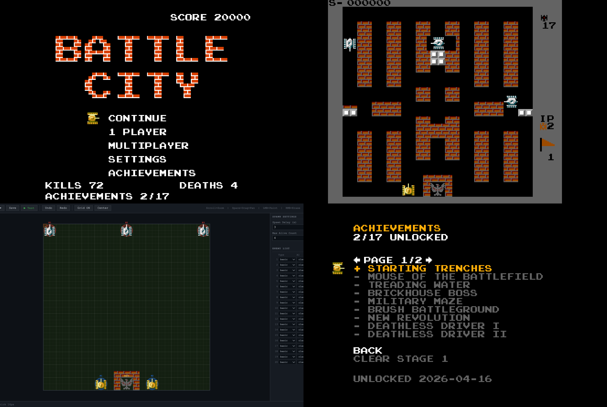

# Battle City Reforged

Battle City (1985, Namco) remake written from scratch in TypeScript.

### [Play web version](https://dderevjanik.github.io/battle-city-reforged/) | [Map Editor](https://dderevjanik.github.io/battle-city-reforged/editor) | [Fonts Viewer](https://dderevjanik.github.io/battle-city-reforged/fonts)



## About

This is a fork of the original [cattle-bity](https://github.com/dogballs/cattle-bity) by **Michael Radionov**, which was a faithful Battle City clone in TypeScript. This fork extends it with new features, game modes, and improvements.

Project is not commercial and was created for learning purposes only.

## What's Different from Battle City

- Up to 4 players on one PC (original supported 2)
- 3 difficulty levels: Classic, Hard, Extreme
- 17 unlockable achievements (based on [RetroAchievements](https://retroachievements.org/game/2420))
- 3 campaigns, 105 levels total — Original (35), Googie City (35) and Random City (35), imported from fan-made NES hacks
- Full [level editor](https://dderevjanik.github.io/battle-city-reforged/editor) with JSON save/load
- Custom maps mode
- Gun powerup with instant max-tier upgrade and rare weighted spawning
- Toggleable friendly fire in multiplayer
- Multiple enemy AI behaviors: Hunter, Ambush, Attack Base, Patrol
- Special enemy variants: Fast Bomber, Fast Armored
- Demo mode (AI plays automatically)
- Gamepad, keyboard, and touch input support
- Customizable keybindings
- Modern and Classic tilesets
- Level progress tracking
- Single-player Continue (resume an interrupted run from the Main Menu)
- In-game score display and highscores

## Features

- Single player campaign with Continue support — pick from 3 campaigns (Original, Googie City, Random City; 35 levels each, 105 total). Auto-saves at the start of each level so you can resume from the Main Menu after closing the tab; cleared on death so you can't dodge a game-over
- Multiplayer (up to 4 players, same PC)
- 3 difficulty modes (Classic / Hard / Extreme)
- 7 powerups with weighted spawn distribution — enemy tanks can also pick up powerups
- 6 tank types (Basic, Fast, Fast Armored, Fast Bomber, Medium, Heavy)
- Multiple enemy AI behaviors
- Level previews on the stage select screen
- 17 achievements (based on [RetroAchievements](https://retroachievements.org/game/2420))
- [Level editor](https://dderevjanik.github.io/battle-city-reforged/editor) with save/load and shareable play links — a single URL that boots the game straight into your custom level, no file upload needed
- Custom maps mode
- Demo mode
- Keyboard, gamepad, and touch input
- Customizable keybindings and audio settings
- Score tracking and highscores
- Offline support via PWA — installable and fully playable offline after first load

## Apps

The repo ships four entry points:

- **Game** — `/` — the playable game (single player, multiplayer, custom maps, demo)
- **Map Editor** — `/editor` — design levels, save/load JSON, generate shareable play links
- **Fonts Viewer** — `/fonts` — browse the bitmap font glyphs used by the UI
- **NES ROM extractor** — `src/nes` — Node CLI that parses an original Battle City `.nes` ROM and exports its 35 stages as `MapDto` JSON. Run with `npm run nes:import -- <rom.nes> [--out <dir>] [--stage N] [--all]`.

## Getting Started

Prerequisites: Node >= 24

```bash
npm install
npm start          # dev server (opens browser at /, /editor, /fonts)
npm run build      # production build
npm run typecheck  # type checking
npm test           # run tests
npm run nes:import -- path/to/rom.nes  # extract stages from a .nes ROM
```

## Tech Stack

- TypeScript 6
- Phaser 4
- Vite 8
- Service Worker (custom) for offline play and PWA install

## Acknowledgments

- Original project [cattle-bity](https://github.com/dogballs/cattle-bity) by **Michael Radionov** — the foundation this fork builds upon
- "Googie City" levels by **Googie** — 35 levels imported from the Battle City NES hack of the same name
- "Random City" levels by **Dendymask** — 35 levels imported from the Battle City NES hack of the same name
- Battle City by Namco (1985) — the classic game that inspired it all

## License

**MIT**

See `LICENSE.md` and `docs/legal/MIT`
